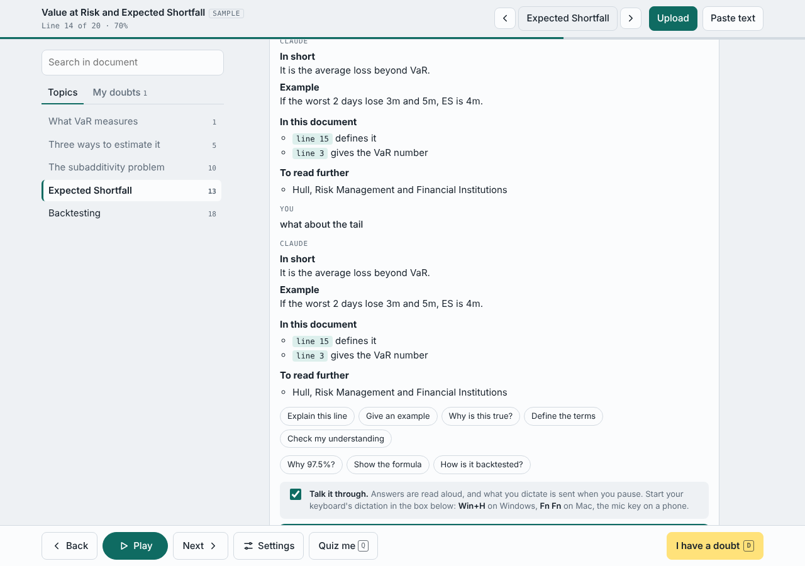
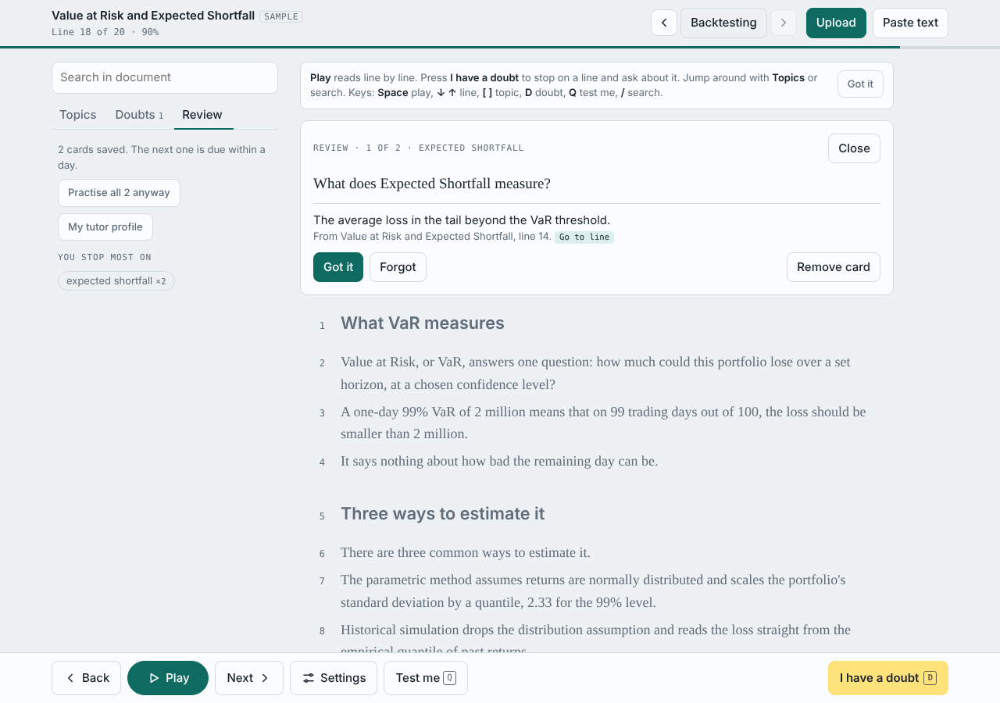
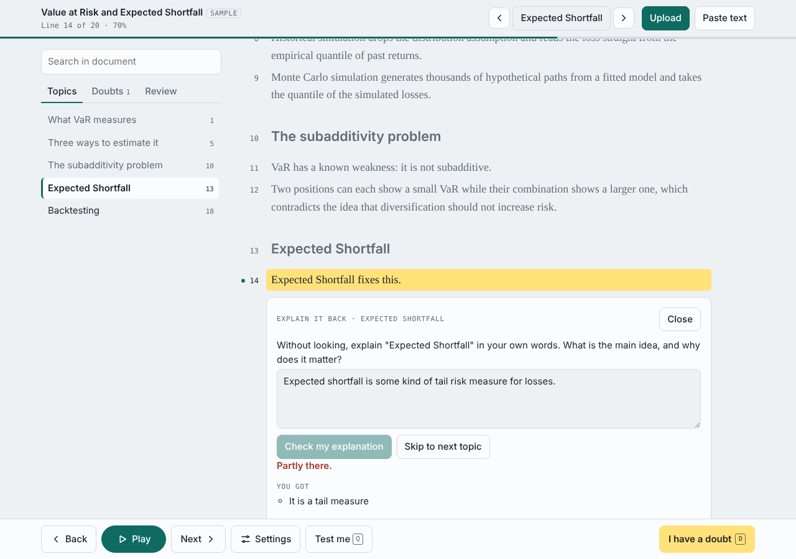
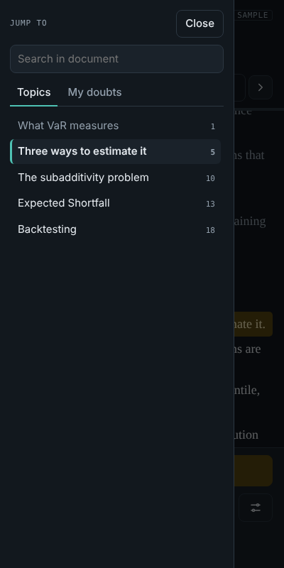

# Line by Line

A study reader that goes through a document one line at a time and stops whenever you have a doubt. You can ask about the exact line you are on, and it keeps track of what you struggled with so it comes back for review.

## What it does

- **Reads line by line.** Upload a PDF, Word file (.docx) or text file, or paste text. It splits the document into sentences, highlights the current one and can read it aloud. You pick the voice, the speed, and whether it pauses after each paragraph or topic.
- **Stops on a doubt.** Press *I have a doubt* (or `D`) to pause on the current line and ask about it. The first answer always has a short explanation, a worked example, another angle on the idea, links to related lines in the same document, and sources to read further. Then you get suggested follow-up questions.
- **Jumps between topics.** Headings are detected from PDF font sizes, Word heading styles and plain-text patterns. They show up in a topics panel with search. Running headers, footers and page numbers are removed from PDFs.
- **Acts as a tutor.**
  - A learner profile (level, goal, strengths, weak areas) shapes every answer.
  - *Explain it back* asks you to explain a topic from memory and grades the explanation.
  - Quick quizzes test each topic.
  - Every doubt and every missed question becomes a flashcard on a spaced schedule (1, 3, 7, 14 and 30 days).
- **Talk it through.** Answers can be read aloud, and text you dictate with your system's dictation is sent when you pause.

| Review cards | Explain it back | Phone layout |
|---|---|---|
|  |  |  |

## How it is built

- One self-contained `index.html` in plain JavaScript, with no build step.
- [pdf.js](https://mozilla.github.io/pdf.js/) and [mammoth.js](https://github.com/mwilliamson/mammoth.js) are loaded from cdnjs only when a PDF or Word file is opened.
- Text is split into sentences with `Intl.Segmenter`, plus fixes for abbreviations and list numbers.
- Heading detection uses font-size statistics for PDFs (the body size is the size carrying the most text) and pattern rules for plain text.
- Spaced repetition uses fixed intervals, and a missed card resets to the next day.
- Speech uses the Web Speech API. Voices are ranked so neural and natural voices come first, and text is cleaned so it reads the way a person would say it.

## Running it

The page was built as a Claude artifact. The AI features (answering doubts, quizzes, explain-back grading, naming topics) and the cross-device save use the Claude artifact runtime (`window.claude`). They only work when the page is opened as an artifact in Claude.

If you open `index.html` directly in a browser, these still work:

- reading and read-aloud
- topics and search
- the review cards you already have, saved in that browser

The AI features show a notice that they need Claude.
